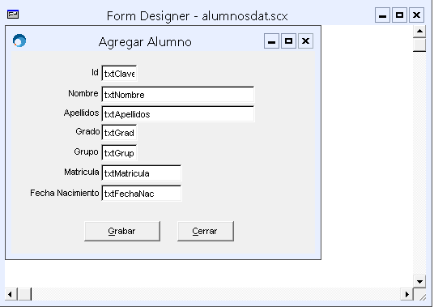
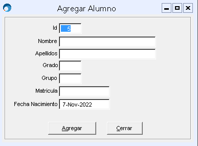
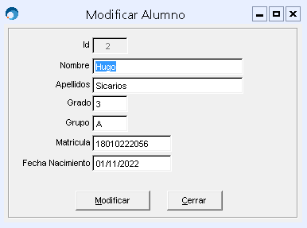
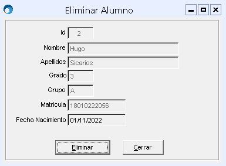
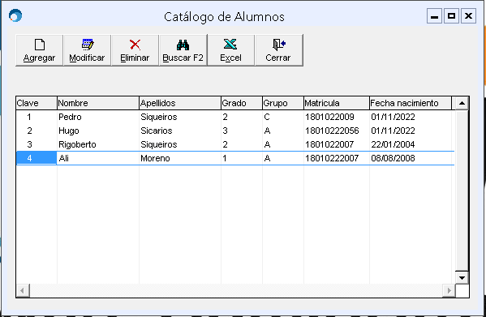

## Crear catalógo de Alumnos
El objetivo de este documento es tener registro de como crear catalógos para integrar en desarrollos especiales a SAIT.

### Nota
Para poner atajos de teclado en VFP se usa la siguiente expresión [\ <] ambos singos juntos y sin los corchetes

Es necesario agregar el archivo refer.prg para no tener problemas de referencia.

Todos los formularios creados deben ser integrados al proyecto que se compilará

#### Alumnos Dbf
- ID
- Nombre
- Apellidos
- Grado
- Grupo
- Matricula
- Fecha Naciemiento

1. Lo primero que se debe hacer es crear un proyecto ya sea meadiante comandos dentro del entorno de VFP o mediante el asistente de VFP.

```
    crea proj alumnos 
```

2. El siguiente paso es crear las formas que seran utilizadas en el modulo de estudiantes
    - Forma para el catalógo 
    - Forma para el CRUD del catalógo
    - Forma para hacer búsquedas

Para crear la forma del catalógo se usa la clase catmsl de la librería msllib60.vcx
```
    crea form alumnoscat as catmsl from f:\pedro\msllib60\msllib60.vcx
```

Para el catalógo no es necesario cambiar el diseño solo se agrega el siguiente código en el evento init de la forma.
```
*
*	init()
*

*
* 	OpenDbf
* Params
*	@ALumnos: Tabla
*	@ID: Indice
* Returns	
*	Si puede abrir la tabla retorna un .t. de lo contrario .f.
*

if not OpenDbf('Alumnos', 'ID')
    return .F. 
EndIf

*
* Params
*	@cAlias = Tabla que usara el grid
*	@cCatName = Nombre del catalogo
*	@FomaCatalogo = Forma para CRUD
*	@FormaBusqueda = Forma para buscar
*	@cAnchos = Anchos de las columnas del grid, se pasa como String separado por "|"
*	@cTitulo = Son los encabezados de las columnas del grid
*	@cExprs = Los campos que se mostraran en el grid
*

this.cAlias = 'Alumnos'
this.cCatName = 'alumnoscat'
this.FormaCatalogo = 'alumnosdat'
this.FormaBusqueda = 'ListAlu'
this.cAnchos = '50|100|100|50|50|80|100'
this.cTitulos = 'Clave|Nombre|Apellidos|Grado|Grupo|Matricula|Fecha nacimiento'
this.cExprs = 'Alumnos.ID|Alumnos.NOMBRE|Alumnos.APELLIDOS|Alumnos.GRADO|Alumnos.GRUPO|Alumnos.MATRICULA|Alumnos.FECHANAC'
```


También es necesario crear una forma con la clase Formamsl para la ventana del CRUD.
```
    crea form alumnosdat as Formamsl from f:\pedro\msllib60\msllib60.vcx
```

Se crea el diseño de la interfaz y se agregan dos métodos y una propiedad

- SaveInfo: se usa para guardar o modificar registros
- CargarInfor: se usa para mostrar la info en el grid
- nModo: le indica a la ventana del CRUD en que modo mostrarse
- Init: aquí ira código que facilita la integracion de la ventana con SAIT

#### Diseño de la interfaz



#### Código de SaveInfo 
```
*
*	SaveInfo()
*	

with thisform
	select Alumnos
	replace ID 			with .txtClave.Value,;
			NOMBRE 		with Allt(.txtNombre.Value),;
			APELLIDOS 	with Allt(.txtApellidos.Value),;
			GRADO 		with Allt(.txtGrado.Value),;
			GRUPO 		with Allt(.txtGrupo.Value),;
			MATRICULA 	with Allt(.txtMatricula.Value),;
			FECHANAC 	with .txtFechaNac.dValue
endwith

```

#### Código de CargarInfo
```
    *
*	CargarInfo()
*

* Params
*	@Clave = Identificador de la tabla
*	@Nombre = Nombre del alumno
*	@Apellidos = Apelldios del alumno
*	@Grado = maximo un caracter ejemplo: 1, 2 o 3
*	@Grupo = maximo un caracter ejemplo: A, B o C
*	@Matricula = numero de expediente del alumno
*	@FechaNac = Fecha de nacimiento
*

with thisform
	.txtClave.Value = Alumnos.ID
	.txtNombre.Value = Alumnos.NOMBRE
	.txtApellidos.Value = Alumnos.APELLIDOS
	.txtGrado.Value = Alumnos.GRADO
	.txtGrupo.Value = Alumnos.GRUPO
	.txtMatricula.Value = Alumnos.MATRICULA
	.txtFechaNac.Value = Alumnos.FECHANAC
endwith

```

#### Código init de la ventana
```
*
*	init()
*
LParameter nModo, nRec

*
* nModo
*	1 = Agregar
*	2 = Modificar
*	3 = Eliminar
*

if not OpenDbf('Alumnos', 'ID')
	return .F. 
EndIf

with thisform
	.txtFechaNac.SetValue(date())
	if PCount() == 0
		nModo = 1
	endif
	
	.nModo = nModo
	
	if(.nModo == 2 OR .nModo ==3)
		if(nRec <= 0 OR nRec > Reccount())
			Alerta('Registro no valido')
			return .f.
		endif
		goto nRec
	endif
	
	do case
		case .nModo == 1
			.Caption = 'Agregar Alumno'
			.btnGuardar.Caption = '\<Agregar'
			Select Alumnos
			goto bott
			.txtClave.Value = PadL(Allt(SigDoc(ID)),5)
			
		case .nModo == 2
			.Caption = 'Modificar Alumno'
			.btnGuardar.Caption = '\<Modificar'
			.txtClave.Enabled = .f.
			.CargarInfo()
			
		case nModo == 3
			.Caption = 'Eliminar Alumno'
			.btnGuardar.Caption = '\<Eliminar'
			.CargarInfo()
			.SetAll('enabled',.f.)
			.btnGuardar.enabled = .t.
			.btnCerrar.enabled = .t.
		endcase
endwith
```

nModo 1.



nModo 2.



nModo 3.



Para crear la ventana de búsquedas es necesario crear una forma usando la clase busqueda
```
    crea form ListAlum as Busqueda from f:\pedro\msllib60\msllib60.vcx
```

Una vez creada la ventana es necesario colocar este código en el evento init
```
* 
*	busqueda.init ()
*

with thisform
	.cAnchos = '50,75,100'
	.cCamposBuscar = 'NOMBRE'
	.cCamposSelect = '*'
	.cExprs = 'ID, NOMBRE, APELLIDOS'
	.cFromTable = 'Alumnos'
	.cOrderBy = 'NOMBRE'
	.cRetVal = 'ID'
	.cSql = ''
endwith
```

3. Lo siguiente es crear un archivo PRG para copiar la aplicación en SAIT y que se ejecute como módulo adicional.

#### codigo de make.prg

```
set safety off
build app alumnos from alumnos
copy file alumnos.app to F:\pedro\demo\alumnos.app
```

#### Codigo para crear el dbf
Es necesario crear un prg de VFP.
Este archivo en el proyecto debe ser marcado como el archivo principal para arrancar.

```
*
* Alumnos()
*

*
* Params
*	@Ventas: nombre del menu
*	@Alumnos: nombre del submenu
*	@do doForm: ejecuta un programa para añadir el submenu

procedure alumnos
	addBar('Ventas','Alumnos','do doForm with "alumnoscat" in Alumnos.app')
	crearCampos()
return

*
* doForm()
*
procedure DoForm
lParameters formName,Par1,Par2,Par3,Par4,Par5,Par6,Par7,Par8,Par9

    do case
    case parameters()=1
        do form (formname) 
    case parameters()=2
        do form (formName) with m.Par1 
    case parameters()=3
        do form (formName) with m.Par1,m.Par2 
    case parameters()=4
        do form (formName) with m.Par1,m.Par2,m.Par3
    case parameters()=5
        do form (formName) with m.Par1,m.Par2,m.Par3,m.Par4 
    case parameters()=6
        do form (formName) with m.Par1,m.Par2,m.Par3,m.Par4,m.Par5 
    case parameters()=7
        do form (formName) with m.Par1,m.Par2,m.Par3,m.Par4,m.Par5,Par6
    case parameters()=8
        do form (formName) with m.Par1,m.Par2,m.Par3,m.Par4,m.Par5,Par6,Par7
    case parameters()=9
        do form (formName) with m.Par1,m.Par2,m.Par3,m.Par4,m.Par5,Par6,Par7,Par8
    endCase

return

*
*	CrearCampos()
*
*	Si no existe el archivo alumnos.dbf la funcion lo crea

procedure crearCampos
	if not file('alumnos.dbf')
		create table alumnos (;
				ID c(5),;
				NOMBRE c(50),;
				APELLIDOS c(50),;
				GRADO c(1),;
				GRUPO c(1),;
				MATRICULA c(20),;
				FECHANAC d(8) )
		select alumnos
		index on ID tag id
		use
		cKey = ;
			"delete tag all " + chr(13) +;
			"index on ID tag id" + chr(13)
		strtofile(cKey, 'alumnos.key')
	endif
	
	if not file('alumnos.dbf')
		alerta('No existe alumnos.dbf')
		quitit()
	endif
			
return


```

4. El código anterior compila lo que se desarrolló y lo coloca en la carpeta de SAIT

5. Lo siguiente es ver los resultado en SAIT




#### 